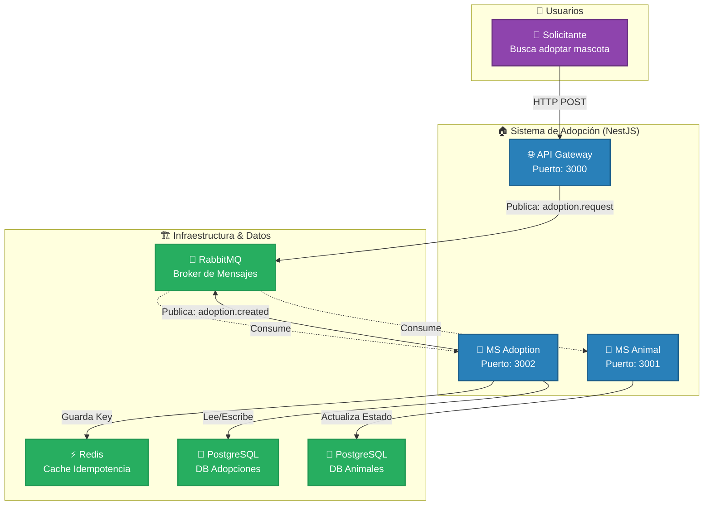

# Sistema de Adopción de Animales - Arquitectura de Microservicios

## Diagrama C4 - Nivel 1: Contexto del Sistema



## Descripción de Componentes

### 1. **API Gateway** (Puerto 3000)
- **Responsabilidad**: Punto de entrada HTTP para clientes externos
- **Tecnología**: NestJS con ClientProxy de RabbitMQ
- **Función**: Recibe solicitudes de adopción y las publica como eventos en RabbitMQ

### 2. **MS Adoption** (Puerto 3002)
- **Responsabilidad**: Gestión de adopciones con garantía de idempotencia
- **Tecnología**: NestJS + TypeORM + Redis
- **Componentes**:
  - **Idempotency Guard**: Previene procesamiento duplicado usando Redis
  - **Adoption Service**: Lógica de negocio para crear adopciones
- **Base de Datos**: PostgreSQL (adoption_db) en puerto 5433
- **Eventos**: 
  - Consume: `adoption.request` desde `adoption_queue`
  - Publica: `adoption.created` hacia `animal_queue`

### 3. **MS Animal** (Puerto 3001)
- **Responsabilidad**: Gestión del estado de animales
- **Tecnología**: NestJS + TypeORM
- **Función**: Marca animales como adoptados cuando recibe eventos
- **Base de Datos**: PostgreSQL (animal_db) en puerto 5434
- **Eventos**: 
  - Consume: `adoption.created` desde `animal_queue`

### 4. **RabbitMQ** (Puertos 5672, 15672)
- **Responsabilidad**: Message broker para comunicación asíncrona
- **Colas**:
  - `adoption_queue`: Para eventos de solicitud de adopción
  - `animal_queue`: Para notificaciones de adopción creada

### 5. **Redis** (Puerto 6379)
- **Responsabilidad**: Cache distribuido para control de idempotencia
- **Uso**: Almacena message_id procesados para evitar duplicados

### 6. **PostgreSQL**
- **adoption_db** (Puerto 5433): Almacena registros de adopciones e idempotencia
- **animal_db** (Puerto 5434): Almacena información de animales

## Flujo de Adopción

1. **Usuario** envía `POST /adoptions` con `{animal_id, adopter_name}` al **Gateway**
2. **Gateway** genera un UUID único y publica evento `adoption.request` en RabbitMQ
3. **MS Adoption** consume el evento desde `adoption_queue`
4. **Idempotency Guard** verifica en Redis si el mensaje ya fue procesado
5. Si es nuevo:
   - Crea el registro de adopción en PostgreSQL
   - Guarda el message_id en Redis
   - Publica evento `adoption.created`
6. **MS Animal** consume el evento desde `animal_queue`
7. **MS Animal** actualiza el estado del animal a "adoptado" en su base de datos

## Características Clave

- ✅ **Idempotencia**: Previene procesamiento duplicado mediante Redis
- ✅ **Comunicación Asíncrona**: Desacoplamiento mediante RabbitMQ
- ✅ **Separación de Responsabilidades**: Cada microservicio con su propia base de datos
- ✅ **Confirmación de Mensajes**: ACK manual para garantizar procesamiento
- ✅ **Event-Driven Architecture**: Comunicación basada en eventos de dominio

## Tecnologías Utilizadas

- **Framework**: NestJS
- **Lenguaje**: TypeScript
- **Message Broker**: RabbitMQ 3.11
- **Base de Datos**: PostgreSQL 17
- **Cache**: Redis 7
- **ORM**: TypeORM
- **Containerización**: Docker Compose

## Ejecución

```bash
# Levantar infraestructura
docker-compose up -d

# Instalar dependencias
cd ms-gateway && npm install
cd ms-adoption && npm install
cd ms-animal && npm install

# Ejecutar microservicios
cd ms-gateway && npm run start:dev
cd ms-adoption && npm run start:dev
cd ms-animal && npm run start:dev
```

## Endpoints

- **Gateway**: http://localhost:3000
  - `POST /adoptions` - Solicitar adopción
- **MS Adoption**: http://localhost:3002
- **MS Animal**: http://localhost:3001
- **RabbitMQ Management**: http://localhost:15672 (guest/guest)
