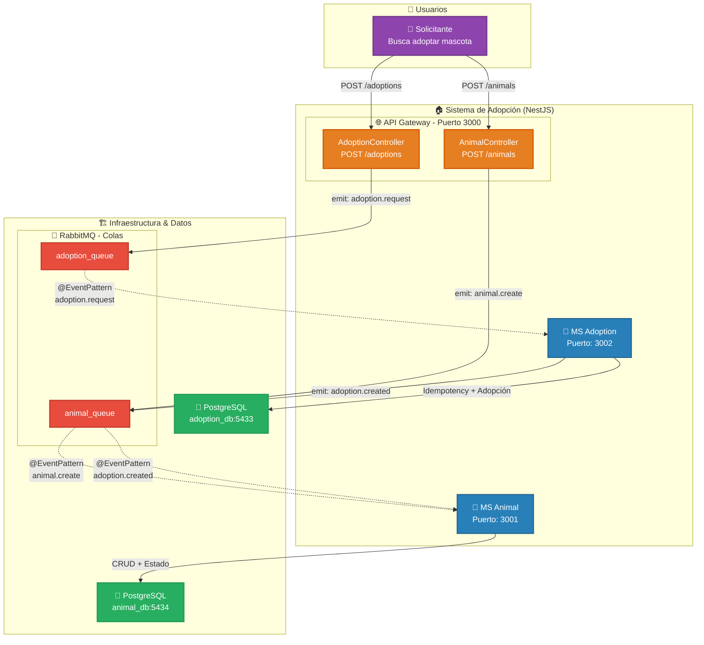

# Sistema de Adopción de Animales - Arquitectura de Microservicios

## Diagrama C4 - Nivel 1: Contexto del Sistema



## Descripción de Componentes

### 1. **API Gateway** (Puerto 3000)
- **Responsabilidad**: Punto de entrada HTTP para clientes externos
- **Tecnología**: NestJS con ClientProxy de RabbitMQ
- **Estructura Modular**:
  - `AnimalModule` → `AnimalController` → `POST /animals`
  - `AdoptionModule` → `AdoptionController` → `POST /adoptions`
- **Función**: Recibe solicitudes HTTP y las publica como eventos en RabbitMQ

### 2. **MS Adoption** (Puerto 3002)
- **Responsabilidad**: Gestión de adopciones con garantía de idempotencia
- **Tecnología**: NestJS + TypeORM + PostgreSQL
- **Estructura**:
  - `adoption/` → Controlador, Servicio y Entidad de Adopción
  - `idempotency/` → Guard, Service y Entity para control de duplicados
- **Base de Datos**: PostgreSQL (adoption_db) en puerto 5433
- **Eventos**: 
  - Consume: `adoption.request` desde `adoption_queue`
  - Publica: `adoption.created` hacia `animal_queue`

### 3. **MS Animal** (Puerto 3001)
- **Responsabilidad**: Gestión del ciclo de vida de animales
- **Tecnología**: NestJS + TypeORM
- **Estructura**:
  - `animal/` → Consumer, Service y Entity
- **Funciones**:
  - Crear animales nuevos (con idempotencia por nombre+especie)
  - Marcar animales como adoptados
- **Base de Datos**: PostgreSQL (animal_db) en puerto 5434
- **Eventos**: 
  - Consume: `animal.create` desde `animal_queue` (creación)
  - Consume: `adoption.created` desde `animal_queue` (actualización estado)

### 4. **RabbitMQ** (Puertos 5672, 15672)
- **Responsabilidad**: Message broker para comunicación asíncrona
- **Colas**:
  - `adoption_queue`: Para eventos `adoption.request`
  - `animal_queue`: Para eventos `animal.create` y `adoption.created`
- **Características**: ACK manual, colas durables

### 5. **PostgreSQL**
- **adoption_db** (Puerto 5433): Almacena adopciones + tabla de idempotencia
- **animal_db** (Puerto 5434): Almacena información y estado de animales

## Flujos del Sistema

### Flujo 1: Crear Animal
1. **Usuario** envía `POST /animals` con `{name, species}` al **Gateway**
2. **Gateway** (AnimalController) genera UUID y publica `animal.create` en `animal_queue`
3. **MS Animal** consume el evento
4. Verifica idempotencia (nombre+especie únicos)
5. Si es nuevo → crea animal en PostgreSQL
6. ACK del mensaje

### Flujo 2: Solicitar Adopción
1. **Usuario** envía `POST /adoptions` con `{animal_id, adopter_name}` al **Gateway**
2. **Gateway** (AdoptionController) genera UUID y publica `adoption.request` en `adoption_queue`
3. **MS Adoption** consume el evento
4. **IdempotencyGuard** verifica si el message_id ya fue procesado
5. Si es nuevo:
   - Guarda message_id en tabla de idempotencia
   - Crea registro de adopción en PostgreSQL
   - Publica `adoption.created` hacia `animal_queue`
6. **MS Animal** consume `adoption.created`
7. Verifica si el animal ya está adoptado (idempotencia)
8. Si no → actualiza estado a "adoptado"
9. ACK del mensaje

## Características Clave

- ✅ **Idempotencia Multinivel**: 
  - En MS Adoption: Por message_id (tabla idempotency)
  - En MS Animal: Por lógica de negocio (estado del animal)
- ✅ **Comunicación Asíncrona**: Desacoplamiento mediante RabbitMQ
- ✅ **Gateway Modular**: Controladores separados por dominio
- ✅ **Separación de Responsabilidades**: Cada microservicio con su propia BD
- ✅ **ACK Manual**: Garantiza procesamiento completo antes de confirmar
- ✅ **Event-Driven Architecture**: Comunicación basada en eventos de dominio

## Tecnologías Utilizadas

- **Framework**: NestJS
- **Lenguaje**: TypeScript
- **Message Broker**: RabbitMQ 3.11
- **Base de Datos**: PostgreSQL 17
- **ORM**: TypeORM
- **Containerización**: Docker Compose

## Endpoints

- **Gateway**: http://localhost:3000
  - `POST /animals` - Crear animal
  - `POST /adoptions` - Solicitar adopción
- **MS Animal**: http://localhost:3001
  - `GET /animals` - Listar animales
- **MS Adoption**: http://localhost:3002
- **RabbitMQ Management**: http://localhost:15672 (guest/guest)

## Ejecución

```bash
# Levantar infraestructura
docker-compose up -d

# Instalar dependencias (en cada microservicio)
cd ms-gateway && npm install
cd ms-adoption && npm install
cd ms-animal && npm install

# Ejecutar microservicios (cada uno en terminal separada)
cd ms-gateway && npm run start:dev    # Puerto 3000
cd ms-adoption && npm run start:dev   # Puerto 3002
cd ms-animal && npm run start:dev     # Puerto 3001
```

## Pruebas

```bash
# Crear un animal
curl -X POST http://localhost:3000/animals \
  -H "Content-Type: application/json" \
  -d '{"name": "Luna", "species": "Perro"}'

# Solicitar adopción
curl -X POST http://localhost:3000/adoptions \
  -H "Content-Type: application/json" \
  -d '{"animal_id": "<UUID_DEL_ANIMAL>", "adopter_name": "Juan"}'

# Ver animales
curl http://localhost:3001/animals
```
